# OAO 摄影社网站 · 社员使用教程

> 适用版本：v4.1（2026 年 10 月上线）· 网址：<https://oao-photography.pages.dev>
>
> 这份教程写给 OAO 摄影社的社员：怎么看拍摄日历、报名任务、活动结束后交付素材，以及上传照片和登记个人资料。

## 目录

1. 打开网站
2. 网站上都有什么
3. 成员登录
4. 看拍摄日历
5. 打开一个任务
6. 报名任务
7. 我的任务：查看和取消报名
8. 活动结束后交付素材
9. 报名状态说明（被退回了怎么办）
10. 上传照片、贴链接
11. 登记个人资料和 AI 分组
12. 「邀请拍摄」不是给社员用的
13. 深色模式
14. 常见问题

---

## 1. 打开网站

整个网站都上了锁，先输入**网站密码**才能进去。

1. 在浏览器里打开 <https://oao-photography.pages.dev>，电脑和手机都可以。
2. 看到「OAO 摄影社」登录卡片后，在 **访问密码** 框里输入网站密码。
3. 点 **进入**。

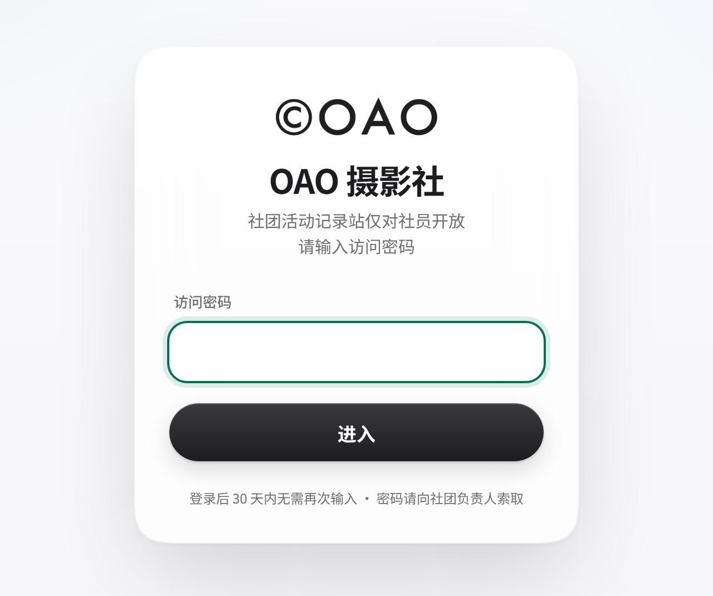

> **提示**　网站密码、成员口令请向社长/管理员索取，不要发到群聊或朋友圈。同一台设备、同一个浏览器登录一次后，30 天内不用再输入网站密码。

## 2. 网站上都有什么

顶部导航栏（电脑）从左到右是：**活动 · 日历 · 作品 · 小红书 · 邀请拍摄 · 加入 · 成员区**，最右边是 **成员登录** 按钮。

在手机上，导航收进右上角的 ☰ 菜单，屏幕底部还有一排快捷标签：**活动 · 日历 · 邀请拍摄 · 小红书 · 成员**。

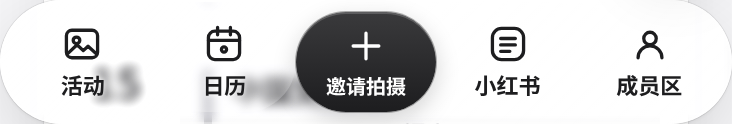

页面从上到下的各个部分：

| 部分 | 标题 | 用途 |
|---|---|---|
| 首屏 | 给同学们记录社团活动… | 社团介绍，按钮「邀请 OAO 拍摄」「看照片合集」 |
| 活动 | 活动记录时间线 | 社团做过的活动，按时间排列 |
| 日历 | 拍摄日历 | **社员最常用**：所有拍摄任务，点开就能报名；下面是「我的任务」 |
| 作品 | 照片合集 | 大家上传的照片，点图片可放大浏览 |
| 小红书 | 小红书 · 作品与动态 | 社团小红书账号，和成员贴上来的小红书 / B站作品 |
| 邀请拍摄 | 邀请 OAO 来拍你的活动 | 给**其他社团和老师**邀请 OAO 去拍摄用的（见第 12 节） |
| 加入 | 招新意向表 | 只是留个意向，**不会保存**，正式招新以社团群通知为准 |
| 成员区 | 成员工作区 | 上传照片、贴链接、名册的入口，需要成员登录（AI 分组由管理员操作） |
| – | 选择记录方式 / 照片 / 视频工作台 | 照片组、视频组的介绍和各状态的数量 |
| – | 活动素材库 | 活动的网盘链接（带提取码，可一键复制）和上传的照片 |
| – | 成员资料与技能 | 登记自己的资料和技能、查看名册（AI 分组只对管理员开放） |

## 3. 成员登录

看日历不用登录；**报名、交付、上传、看名册**都需要先用成员口令登录。

1. 点右上角的 **成员登录**（手机上在左上角）。
2. 弹出「社团成员登录」窗口，在 **访问口令** 框里输入成员口令。
3. 点 **登录**。看到提示「登录成功，成员工作区已解锁」就成功了。

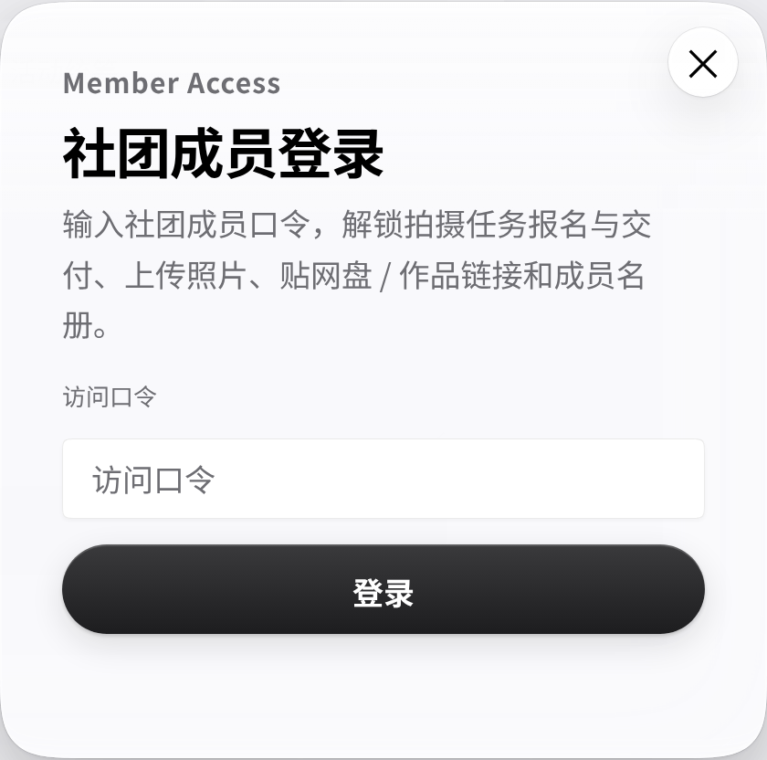

登录后，右上角的按钮变成 **退出登录**，旁边多出 **＋ 上传 / 贴链接**（手机上显示为「＋ 上传」）。

> **注意**　成员登录只在当前这个浏览器标签页有效。关掉标签页后要重新登录。用公共电脑时，用完记得点 **退出登录**。

## 4. 看拍摄日历

点导航里的 **日历**，就到了「拍摄日历」。班赛、文化周和社团活动的拍摄任务都在这里。

### 电脑：月历

电脑上显示一整个月的格子，一周从周一开始。

- 用 **‹** 和 **›** 切换上个月、下个月，点 **今天** 回到本月。今天的日期用红色圆点标出。
- 每个格子最多显示 3 个任务。多出来的显示成「还有 N 项」，点一下可以看当天的全部任务。
- 鼠标停在任务上，可以看到时间和 CAS 时间。

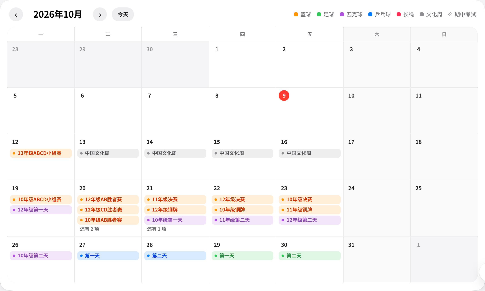

### 手机：按周的列表

手机屏幕窄，日历会自动变成按周分组的列表。每个任务显示三行：任务名、「时间 · 报名人数」，以及「CAS 时间 C 1 · S 1」。已经过去、又没有任务的周不再显示；本周或以后没有任务的周，会显示一行「本周暂无任务」。

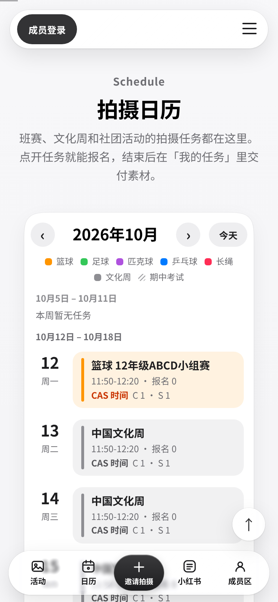

### 颜色代表类别

月历右上角有图例，每种类别一个颜色：

- **橙色**：篮球；**绿色**：足球；**紫色**：匹克球；**蓝色**：乒乓球；**粉红色**：长绳；**灰色**：文化周（以及「其他」）。
- **斜线底纹**：期中考试（11 月 2 日–6 日），这一周没有拍摄任务。

另外，**已经结束**的任务会变淡，**已取消**的任务名称上有一条删除线。

## 5. 打开一个任务

点日历上的任意任务，会弹出任务详情：

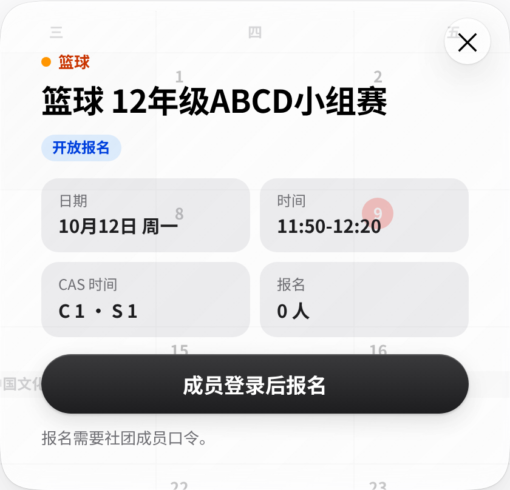

从上到下依次是：

- **类别**（带颜色圆点）和 **任务名称**。
- **任务状态**：
  - 开放报名：可以报名。
  - 已安排：报名已截止，暂不接受报名。
  - 已结束：活动已经结束。
  - 已取消：任务取消了。
- **日期**：例如「10月12日 周一」。
- **时间**：例如「11:50-12:20」，即午休时段。「放学」指 15:30–17:30。没写时间的显示「全天」。
- **CAS 时间**：例如「C 1 · S 1」，表示参加这次拍摄可以记 **C（Creativity）1 小时、S（Service）1 小时**。只有 C 和 S 两项，没有 A。C、S 各自最少 0.5、最多 5 小时，以 0.5 小时为一档，由管理员设定。
- **地点**：有填写时才显示。
- **报名**：例如「0 人」。如果管理员设了需要人数，会显示「（需要 3 人）」；有人被确认时，还会显示「· 已确认 N」。
- **备注**：有填写时才显示。

## 6. 报名任务

1. 在日历上点开一个状态为 **开放报名** 的任务。
2. 如果还没登录，点 **成员登录后报名**，输入成员口令。登录后会自动回到这个任务。
3. 填写 **姓名** 和 **学号**。学号只能是字母、数字、短横线或下划线，2–32 位。
4. 点 **报名这个任务**。看到提示「报名成功 ✓」就报上了。

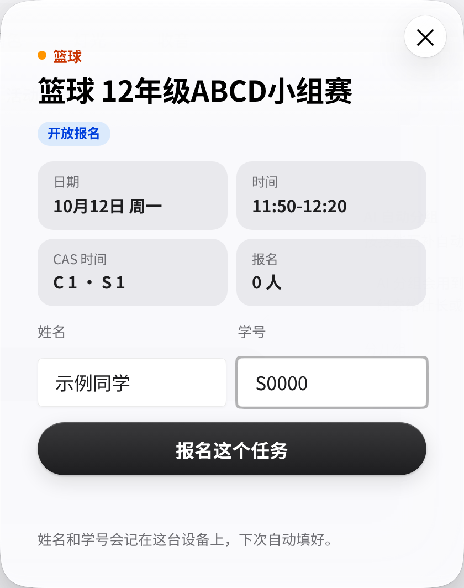

报名成功后，任务详情里会显示「你已报名 已报名」，旁边有 **取消报名** 按钮，还有一行提示「任务时间过了（或管理员标记「已结束」）后，这里会出现「交付素材」。」

> **提示**　姓名和学号会记在这台设备上，下次自动填好。同一个任务用同一个学号重复报名，只会提示「你已经报过名了」，不会重复记录。

> **请诚实报名**　只用**自己的**姓名和学号报名。管理员能看到每一条报名，冒名报名会被取消。

## 7. 我的任务：查看和取消报名

「我的任务」在拍摄日历的正下方。

1. 第一次使用时，输入 **姓名** 和 **学号**，点 **查看我的任务**。如果你在这台设备上报过名，会自动填好。
2. 列表里是你报名的每个任务，包括名称、日期、时间和当前状态。
3. 标题右边会显示「姓名 · 学号 · 切换」。在别人的设备上用完后，点 **切换** 可以清掉这台设备上保存的身份。

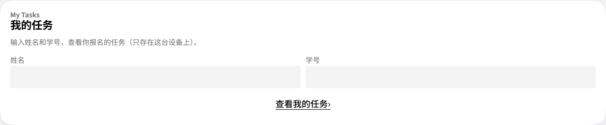

**取消报名：**

1. 在「我的任务」里点任务旁边的 **取消**。也可以在任务详情里点 **取消报名**。
2. 在弹出的「确定取消报名吗？」里点确定，看到提示「已取消报名」即可。

> **注意**　只能在**任务结束前**取消，而且只有「已报名」「已确认」两种状态可以取消。取消后，这条报名会从列表里消失。只要任务还在开放报名，想参加可以再报一次。

## 8. 活动结束后交付素材

活动时间一过（例如 11:50-12:20 的任务在 12:20 之后），或者管理员把任务标成「已结束」，就可以交付素材了。

1. 把照片或视频传到**百度网盘**，生成分享链接。有效期建议选「永久有效」。
2. 打开网站，在 **我的任务** 里点 **交付**，或者在任务详情里点 **交付素材**。
3. 在「交付素材」窗口里填写：
    - **百度网盘分享链接**：必须是 `https://pan.baidu.com/s/…` 这样的链接。
    - **提取码（4 位，可选）**：4 位字母或数字。如果链接里带了 `?pwd=xxxx`，提取码会自动填好。
    - **素材描述**：必填，写清拍了什么、精选放在哪个文件夹、有什么要注意的。
4. （可选）点 **✦ AI 润色成配图文案**。AI 会把你的描述写成一段可以直接发小红书的配图文案，显示在新出现的 **配图文案（可改）** 框里，可以自己修改。
5. 点 **提交交付**。看到提示「素材已交付，等管理员验收」就完成了。

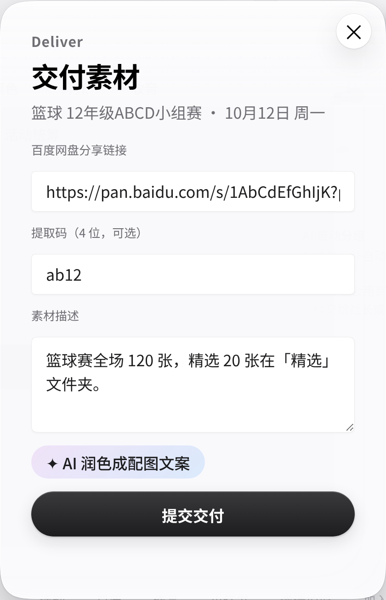

> **关于 ✦ AI 润色**　至少先写几句素材描述，AI 才能润色。按钮旁会显示这次花了多少钱，例如「本次约 ¥0.0007 · 本月已用 ¥0.12 / ¥20」。全社每月 AI 预算有限，满意就别反复点。

> **交付错了？**　在管理员「验收」之前，都可以点 **重新交付**，覆盖上一次的内容。

## 9. 报名状态说明

| 状态 | 意思 | 你需要做什么 |
|---|---|---|
| **已报名** | 报名成功，等管理员确认 | 等待；不能去可以在任务结束前取消 |
| **已确认** | 管理员确认由你去拍 | 按时到场拍摄 |
| **已交付** | 你已提交网盘链接，等管理员验收 | 等待；验收前还可以重新交付 |
| **已验收** | 管理员检查通过，这次任务完成 | 不需要再做什么 🎉 |
| **已退回** | 素材有问题，被退回了 | 看退回原因，改好后重新交付 |
| **已取消** | 你或管理员取消了报名 | 列表里不再显示；需要的话可以重新报名 |

**被退回了怎么办？**

1. 打开 **我的任务**，被退回的任务下面会显示「管理员：……」，这就是退回原因，比如「链接打不开 / 缺精选」。
2. 按原因修改。例如重新生成分享链接、补上精选照片。
3. 点这个任务的 **交付**，填好新内容后 **提交交付**。状态会回到「已交付」，等管理员再次验收。

> **参加了但没报名？**　任务结束后就不能再报名了，任务详情会提示「参加了但没报名？请联系管理员补登记。」这时请找管理员帮你补上。

## 10. 上传照片、贴链接

除了任务交付，社员还可以把照片和链接直接放进网站的资料库。登录后点右上角的 **＋ 上传 / 贴链接**，或者在 **成员工作区** 点对应的卡片：**上传照片 · 贴网盘链接 · 贴 B站 / 小红书 · 名册 · AI 分组**。

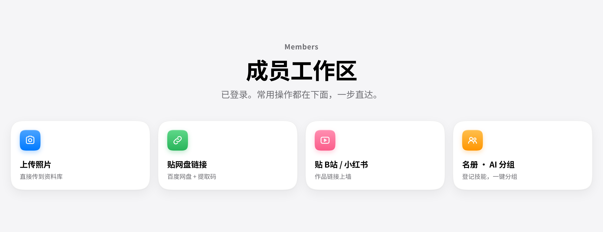

「上传 · 贴链接」窗口有三种 **入库方式**：

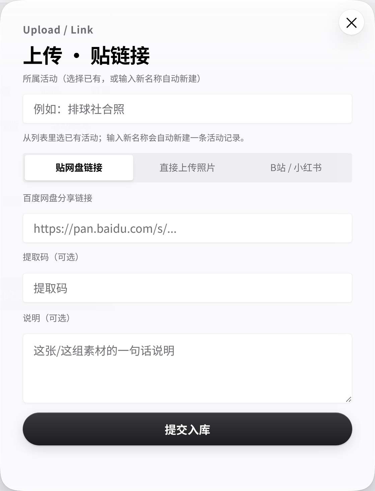

**贴网盘链接**

1. 在 **所属活动（选择已有，或输入新名称自动新建）** 里填活动名称。从下拉列表里选已有的活动最好；输入框下方会提示是已有活动，还是「将新建」。
2. 粘贴 **百度网盘分享链接**，有提取码就填进 **提取码（可选）**。
3. 写一句 **说明（可选）**，点 **提交入库**。链接会出现在「活动素材库」里。

**直接上传照片**

1. 选好 **所属活动**，点 **选择照片**，选一张图片。单张最大约 20 MB，上传大约需要 10 秒。
2. 选一个 **分类**（campus / sports / stage / collab / landscape），点 **提交入库**。照片会出现在「照片合集」里。

**B站 / 小红书**

1. 选择 **平台**（B站 / 小红书 / 其他），填 **标题** 和 **作品链接**。这种方式不用填所属活动。
2. 点 **提交入库**。作品会出现在「小红书 · 作品与动态」里。

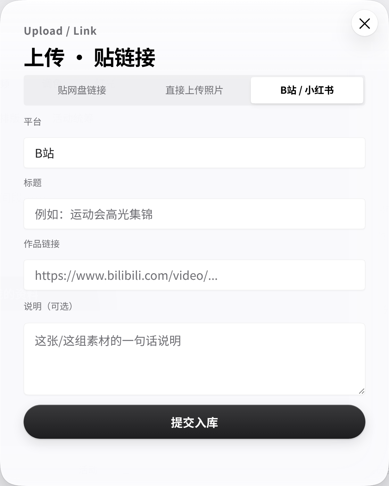

看到提示「素材已入库，稍后刷新可见」就成功了。

> **注意**　这里的上传**不等于任务交付**。拍摄任务的素材一定要在「我的任务」里点「交付」，管理员才能验收。另外，填一个新的活动名称会自动新建一条活动记录（照片数从 1 开始），所以请先看看下拉列表里有没有同一个活动，避免一个活动建两条。

## 11. 登记个人资料和 AI 分组

在 **成员资料与技能** 部分（也可以点成员工作区的「名册 · AI 分组」）登记一次资料，排班和分组时都用得上。

1. 填写 **姓名**、**班级**（例如 G11-3）、**学号**，以及可选的 **性别** 和 **社内职位**。
2. 在 **可选技能** 里点选，或者把技能标签拖进上方的 **我掌握的技能** 方框，至少选一个。可选的技能有：拍照、修图、拍视频、剪视频、调色、灯光、收音、无人机、平面设计、文案、排版、活动统筹。
3. **补充说明（可留空）**：写擅长的设备、想练的方向、不方便的时间段等。
4. 点 **保存我的资料**。以后用同一个学号再保存，会提示「已按学号更新你的资料。」，不会产生重复记录。

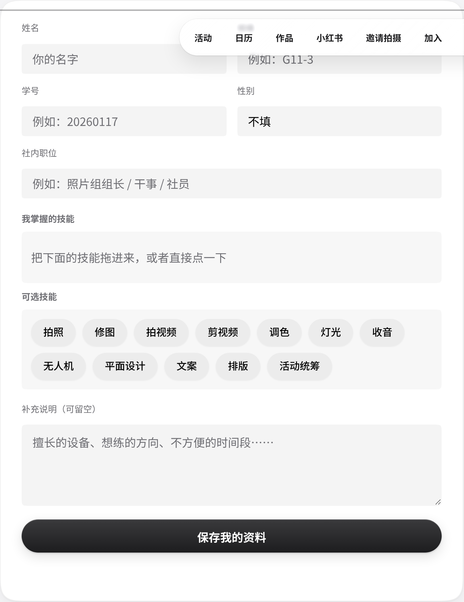

右边的 **已登记成员** 名册只显示姓名、班级、性别、职位和技能，不显示学号。

**AI 自动分组**

名册下方是「AI 自动分组」，可以按技能互补把已登记的成员自动分组。**AI 分组只对管理员开放**：社员登录时按钮是灰的，下面有提示「AI 分组会用到全社共用的 AI 额度，只对管理员开放……」。社员只要登记好资料，分组交给社长或组长。

管理员的操作步骤：

1. 在 **分几组** 里填 2–20 之间的整数。
2. 点 **开始分组**。
3. 结果出来后会提示「分组完成，请人工复核后再执行。」，结果同时留档。AI 分组只是建议，以组长的安排为准。

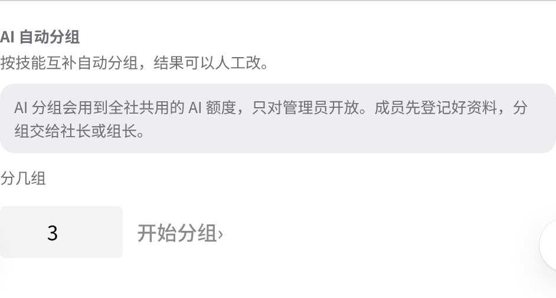

> **提示**　登记资料的人数必须不少于组数。每次分组都会花一点全社共用的 AI 额度。

## 12. 「邀请拍摄」不是给社员用的

网站上的 **邀请拍摄**（首屏按钮「邀请 OAO 拍摄」、手机底部中间的「邀请拍摄」）对应的是「邀请 OAO 来拍你的活动」表单。这张表是给**其他社团、活动组织者和老师**用的，用来请 OAO 去拍他们的活动。

**社员想参与拍摄，请去拍摄日历报名任务，不要填这张表。**

## 13. 深色模式

网站会自动跟随手机或电脑的系统设置：系统是深色，网站就是深色；系统是浅色，网站就是浅色。网站里没有切换按钮，改系统设置后页面会立即跟着变，不用刷新。

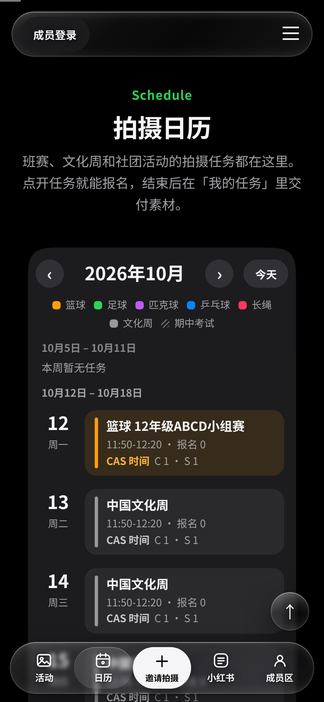

如果系统里打开了「降低透明度」，网站上的毛玻璃效果会换成不透明的底色，文字更容易看清。

## 14. 常见问题

**问：网站密码 / 成员口令是多少？**  
答：网站密码、成员口令请向社长/管理员索取。请不要转发给社外的人。

**问：输入口令后提示「口令不正确」？**  
答：检查有没有多打空格、大小写对不对。注意，进网站用的「网站密码」和成员登录用的「成员口令」是两个不同的东西。

**问：为什么点了任务没有「报名这个任务」按钮？**  
答：可能是以下几种情况：

- 你还没登录。这时会显示「成员登录后报名」。
- 任务状态不是「开放报名」，比如已安排或已取消。
- 任务已经结束了。

**问：活动结束了，为什么还没有「交付」按钮？**  
答：交付要等到任务的结束时间之后才会出现，例如「11:50-12:20」的任务要等到 12:20 之后，「放学」的任务要等到 17:30 之后；如果活动提前结束，管理员把任务标成「已结束」后也会出现。刷新页面再看看。

**问：提交交付时提示「请粘贴百度网盘分享链接（https://pan.baidu.com/s/…）」？**  
答：只接受百度网盘的分享链接。请在百度网盘里点「分享」生成链接后，整条复制过来。

**问：提示「提取码是 4 位字母或数字」？**  
答：提取码必须正好 4 位。没有提取码就留空。

**问：「我的任务」里看不到我报的任务？**  
答：确认上方显示的学号和报名时填的完全一样。不一样就点 **切换**，重新输入。

**问：换了手机或电脑怎么办？**  
答：姓名和学号只保存在原来的设备上。在新设备上重新输入一次即可，报名记录不会丢。

**问：页面一直在加载，或者提示「重试」？**  
答：网站的数据来自飞书，每次加载大约需要 3–7 秒。如果失败了，点 **重试** 或刷新页面。

**问：「加入」里的表单提交了，社长能看到吗？**  
答：看不到。那张表只是留个意向，不会保存。正式招新以社团群通知为准。
