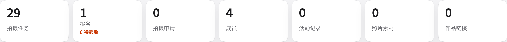
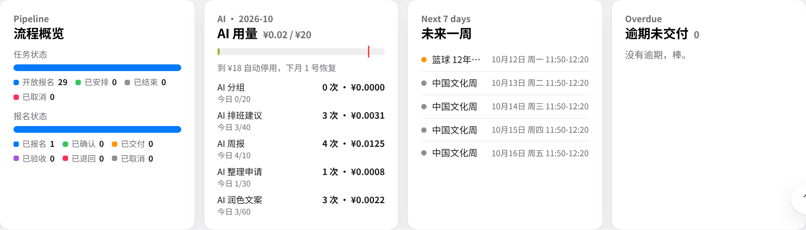
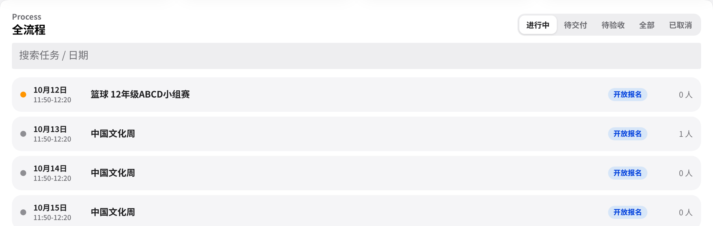
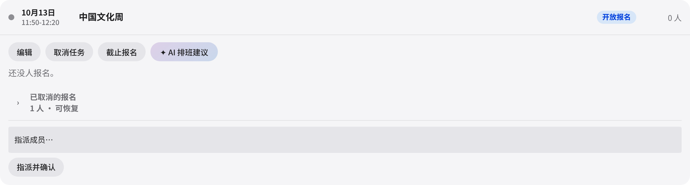
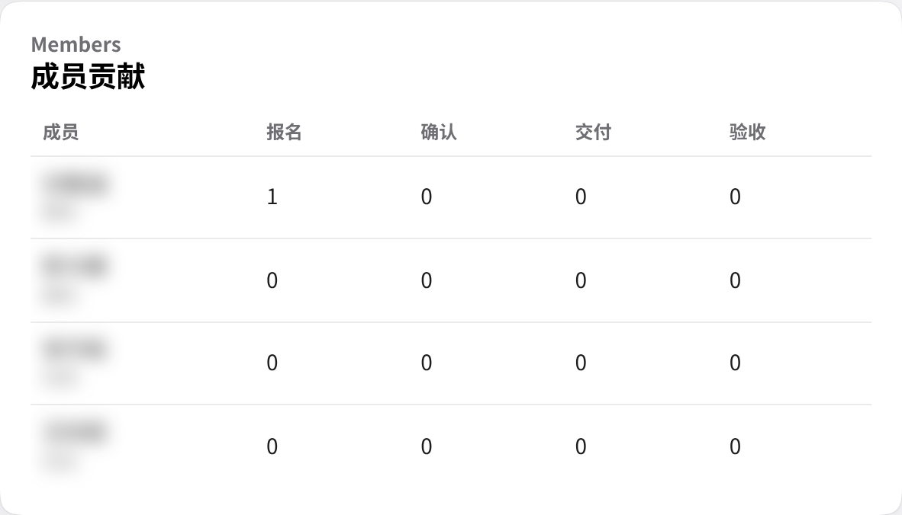
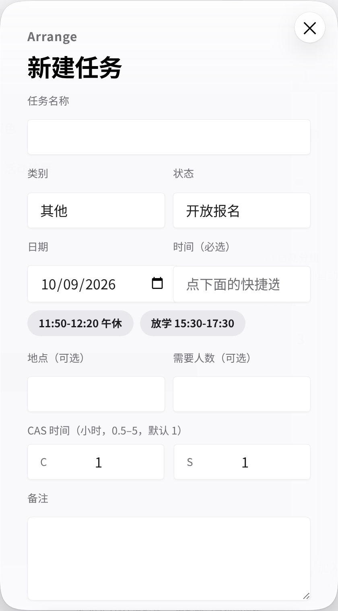
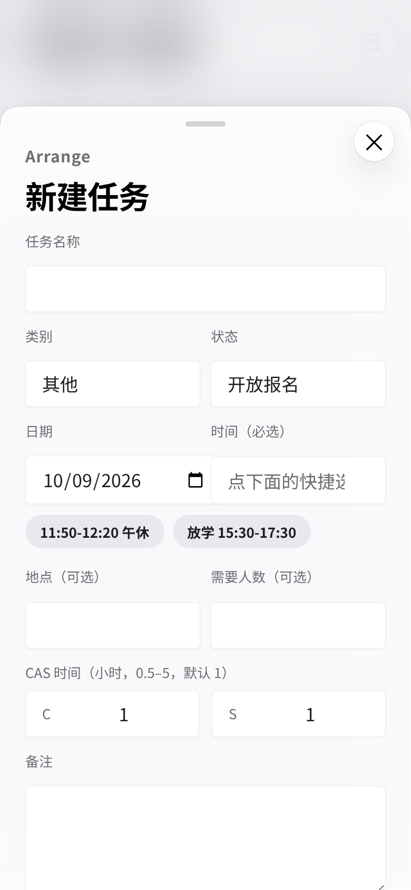

# OAO 摄影社网站 · 管理员使用教程

> 适用版本：v4.1（2026 年 10 月上线）· 网址：<https://oao-photography.pages.dev>
>
> 这份教程写给 OAO 摄影社的管理员（社长、组长等），讲怎么用隐藏的「管理后台」排任务、确认报名、验收素材、处理其他社团的拍摄申请、使用 AI 功能，以及在飞书里直接维护数据。社员的日常操作见《社员使用教程》。

## 目录

1. 打开隐藏的管理后台
2. 管理后台总览
3. 管理拍摄任务
4. 审核报名与交付
5. 处理其他社团的拍摄申请
6. AI 功能与每月 ¥20 上限
7. ✦ AI 周报
8. 在飞书里直接改数据
9. 只能在飞书里完成的事
10. 安全须知
11. 故障排查

---

## 1. 打开隐藏的管理后台

网站上**没有**可见的「管理员入口」。管理后台要在普通的 **成员登录** 窗口里输入**管理员口令**才会出现。

1. 打开网站并输入网站密码（与社员相同）。
2. 点右上角 **成员登录**。
3. 在 **访问口令** 框里输入**管理员口令**（不是成员口令），点 **登录**。
4. 看到提示「管理员模式已开启 · 管理后台已解锁」后，页面会自动滚到 **管理后台**，导航栏里也会多出一个 **管理** 链接。

> **管理员口令**　管理员口令由社长私下单独告知，**不会写在任何文档里**。网站密码、成员口令请向社长/管理员索取。

- 管理员同时拥有全部社员功能，也可以报名、交付、上传。
- 登录只在当前浏览器标签页有效，关掉标签页就会退出。用完请点 **退出登录**。
- 在手机上，「管理」链接在右上角的 ☰ 菜单里。

## 2. 管理后台总览

后台顶部有三个按钮：

- **＋ 新建任务**：新建一个拍摄任务。
- **✦ AI 周报**：生成本周简报，见第 7 节。
- **刷新**：重新读取数据。旁边的「更新于 08:34」是数据读取的时间。

### 2.1 关键数字（KPI）

从左到右依次是：

- **拍摄任务**：任务总数。
- **报名**：有效报名数，不含已取消。下方红字「N 待验收」是已交付、还等你验收的数量。
- **拍摄申请**：其他社团发来的申请数。
- **成员**：成员名册的人数。
- **活动记录**、**照片素材**、**作品链接**：资料库里各类记录的条数。

### 2.2 四张卡片

- **流程概览**：两条彩色条，分别显示各**任务状态**（开放报名 / 已安排 / 已结束 / 已取消）和各**报名状态**（已报名 / 已确认 / 已交付 / 已验收 / 已退回 / 已取消）的数量。
- **AI 用量**：本月 AI 花费，例如「¥0.02 / ¥20」。进度条上的红线是 ¥18 停用线。下面列出每个 AI 功能本月的调用次数、花费，以及「今日 已用/上限」，详见第 6 节。
- **未来一周**：今天起 7 天内、没有取消的任务。点任务名，会跳到下方「全流程」里对应的任务。
- **逾期未交付**：任务结束超过 24 小时，但报名状态还是已报名、已确认或已退回的人。右上角数字是人数。没有逾期时显示「没有逾期，棒。」

### 2.3 全流程（Process）

「全流程」列出所有任务，每行依次是：日期和时间、任务名、状态、报名人数（如「1/3 人」，3 是需要人数）。

- **筛选按钮**：
  - **进行中**：还没结束、没有取消的任务（默认）。
  - **待交付**：已结束，但还有人没交付。
  - **待验收**：有人已交付，等你验收。
  - **全部**：所有任务。
  - **已取消**：已取消的任务。
- **搜索任务 / 日期**：可以按任务名、类别或日期筛选，例如输入「篮球」或「2026-10-2」。
- 点任意一行可以展开，进行编辑、审核、指派等操作，见第 3、4 节。

### 2.4 拍摄申请与成员贡献

页面最下方有两张卡片：

- **拍摄申请**：其他社团和老师提交的拍摄申请，见第 5 节。
- **成员贡献**：每位成员的报名、确认、交付、验收次数。在任务里报过名、但没在名册登记资料的人，会标「未登记资料」。

## 3. 管理拍摄任务

### 3.1 新建任务

1. 点工具栏的 **＋ 新建任务**，打开「新建任务」窗口。
2. 填写各项：
    - **任务名称**：最多 60 字。建议写成「类别 + 空格 + 名称」，例如「篮球 12年级决赛」。月历格子里会自动去掉开头的类别，显示得更短。
    - **类别**：篮球 / 足球 / 匹克球 / 乒乓球 / 长绳 / 文化周 / 其他，决定日历上的颜色。
    - **状态**：新任务一般选「开放报名」。
    - **日期**：选择日期。
    - **时间**：可以从建议里选「11:50-12:20」或「放学」，也可以写成「14:00-15:30」这样的起止时间。时间是必填的，窗口不会预先填好：点下面的快捷按钮「11:50-12:20 午休」或「放学 15:30-17:30」，或者自己填。没填时会提示「请选择时间（11:50-12:20 / 放学）或自己填写」。
    - **地点（可选）**、**需要人数（可选）**：需要人数为 0–50。
    - **CAS 时间（小时，0.5–5，默认 1）**：分别在 **C** 和 **S** 两格里填小时数，见 3.3 节。
    - **备注**：社员在任务详情里能看到，可以写拍摄重点、集合地点等。
3. 点 **保存**。看到提示「任务已保存，日历已更新」后，日历会立刻显示新任务。

> **时间格式很重要**　网站按「时间」判断任务何时结束，结束后社员才能交付、超过 24 小时未交付会算逾期：
>
> - 「11:50-12:20」：12:20 结束。
> - 「放学」：按 15:30–17:30 计算。
> - 只写一个时间（如「15:30」）：按 1 小时计算。
> - 不写时间：按当天 23:59 结束（后台编辑器要求必填，只有在飞书里直接建的任务才可能没有时间）。
>
> 另外，把任务状态改成 **已结束**，会**立刻**开放交付，不用等到时间过去，适合提前拍完的任务。

### 3.2 编辑、截止报名、取消任务

在「全流程」里展开一个任务，上方有一排按钮：

- **编辑**：打开「编辑任务」窗口，可以修改任何字段，包括 CAS 时间。改了任务名称，报名表里的任务名称会自动同步。
- **截止报名**：把任务状态改为「已安排」，不再接受新报名，已报名的人不受影响。只有状态为「开放报名」的任务才有这个按钮。
- **取消任务**：会先弹出确认「确定取消这个任务？成员会在日历上看到「已取消」。」。确认后，任务在日历上显示删除线，不能再报名。
- **恢复**：只有已取消的任务才有，把它改回「开放报名」。
- **✦ AI 排班建议**：见第 6 节。

> **说明**　网站上**不能删除任务**，只能取消。要彻底删除，请到飞书里操作（第 9 节）。状态改成「已结束」会立刻开放交付（任务时间过去也会自动开放，两者满足其一即可）。

### 3.3 设置 CAS 时间（C / S）

每个任务有两项 CAS 时间：**C（Creativity）** 和 **S（Service）**，单位是小时。社员在任务详情和手机列表里看到的样子是「CAS 时间 C 1 · S 1」。

- 取值范围是 **0.5 到 5**，每 0.5 小时一档：0.5、1、1.5 …… 5。
- 新建任务默认是 C 1、S 1。由拍摄申请转来的任务，会用申请人填的 C 和 S（自动调到 0.5–5、0.5 一档；没填就是 1）。申请里的 A 只作参考，不会带进任务。
- 填错时会提示「CAS C 应为 0.5–5 小时，0.5 一档」，改正后再保存。

有两种设置方法：

1. **在管理后台改**：全流程 → 展开任务 → **编辑** → 修改 **C**、**S** → **保存**。
2. **在飞书里改**：打开「拍摄任务」表，直接修改 **CAS-C**、**CAS-S** 两列，都是数字列，例如 1.5。网站下次加载时就会显示新值，可以在后台点 **刷新**。飞书里的格子留空时，网站按 1 显示。

> **注意**　在飞书里直接填的值，网站不会检查。请只填 0.5–5 之间、0.5 一档的数字。

### 3.4 指派成员

有人没报名、但你想让他去拍时，可以直接指派：

1. 在全流程里展开任务，在底部的 **指派成员…** 下拉框里选一位成员。名单来自成员名册。
2. 点 **指派并确认**。这位成员会直接以「已确认」状态出现在报名名单里，管理备注为「管理员指派」。

> 名单里标「（未填学号）」的成员不能指派，会提示「这位成员没有登记学号，请先在名册里补上」。请让他在「成员资料与技能」里登记学号，或者在飞书「成员」表里补上。

## 4. 审核报名与交付

在全流程里展开任务，就能看到报名名单。每一行包括：

- 姓名和学号；
- 报名时间；
- 状态标签；
- 已交付的会多出：**网盘 ↗** 链接、**提取码 xxxx** 按钮（点击即可复制）、素材描述、AI 配图文案（以 ✦ 开头），以及「交付于」时间。

每行右侧的操作按钮会随状态变化：

| 当前状态 | 可用按钮 | 结果 |
|---|---|---|
| 已报名 | **确认** / **取消** | 确认后变为「已确认」；取消后变为「已取消」 |
| 已确认 | **取消** | 变为「已取消」 |
| 已交付 | **验收** / **退回** | 验收后变为「已验收」（完成）；退回后变为「已退回」 |
| 已退回 | **恢复为已确认** | 变回「已确认」 |
| 已取消 | **恢复为已确认** | 先弹出确认；变回「已确认」 |
| 已验收 | **撤销验收** | 先弹出确认；变回「已交付」，可以重新验收或退回 |

**验收流程：**

1. 在 **待验收** 筛选下找到任务，展开。
2. 点 **网盘 ↗** 打开链接；如有提取码，点 **提取码 xxxx** 复制。
3. 检查素材，没问题就点 **验收**。
4. 有问题就点 **退回**。会弹出「退回原因（成员能看到）」输入框，默认文字是「链接打不开 / 缺精选」，可以改成具体原因，点确定。成员会在「我的任务」里看到「管理员：<原因>」，改好后可以重新交付。

> **提示**　「验收」只对已交付的报名有效，否则会提示「还没交付，不能验收」。已取消的报名收在名单下方可展开的「已取消的报名」里，每行有 **恢复为已确认**；用 **已取消** 筛选时会自动展开。点错了「验收」，可以点 **撤销验收** 改回「已交付」。

在日历上用管理员身份打开任务时，详情底部也有一个「在管理后台查看报名 →」链接，点它会关闭详情、滚动到后台里的这个任务并展开、高亮几秒钟。

## 5. 处理其他社团的拍摄申请

其他社团、活动组织者和老师可以在网站的「邀请 OAO 来拍你的活动」部分（导航里叫 **邀请拍摄**）提交申请。表单内容包括：

- 活动名称、活动时间、联系人与联系方式；
- 可选的 CAS 时长（C / A / S）；
- 活动描述。

这些申请会出现在后台的 **拍摄申请** 卡片里，每条显示活动名、时间、描述和联系人，以及「转成任务后 CAS 时间为 C x · S y」的提示。申请**不会**出现在公开的活动时间线和统计数字里，联系方式也只有管理员能看到。

**转为任务**

1. 先根据描述里的联系人联系对方，确认时间和需求。**网站不会自动通知对方。**
2. 点 **转为任务**。打开的「申请 → 任务」窗口里已经填好了名称、日期、时间、备注和 CAS 时间（备注里的联系人和 CAS 两行会自动去掉，保存时也会再去一次），窗口说明「从拍摄申请「…」转换，原申请保持不变。」
3. 核对并补全**类别**、**时间**（尽量写成起止时间）、**需要人数** 和 **CAS 时间**（已按申请里的 C、S 预填，请按实际修改）。备注社员能看到，联系方式不会写进去。
4. 点 **保存**。这条申请会显示「已转为任务」，同一条申请不能重复转换，再转会提示「这条申请已经转成任务「…」」。

**✦ AI 整理**

点 **✦ AI 整理**，AI 会先把申请整理成任务草稿（名称、类别、日期、时间、人数、拍摄重点），再打开同一个编辑窗口，提示「✦ AI 整理的草稿，确认无误再保存。」以及本次花费。草稿的 CAS 时间和直接转换一样，取申请里的 C、S（没填就是 1 / 1）。确认无误后点 **保存**。

> **说明**　申请保存在飞书的「活动记录」表里，「来源」列是「邀请拍摄」、状态是「待处理申请」。网站靠「来源」把它们挡在公开时间线和统计之外，请不要改这一列。不需要的申请可以在飞书里删除。

## 6. AI 功能与每月 ¥20 上限

网站上的 AI 只在**有人点按钮时**才会调用，不会自动运行。发给 AI 的内容里不包含学号和联系方式。

| 功能 | 谁能用 | 在哪里 | 每日上限 | 大约花费 / 次 |
|---|---|---|---|---|
| AI 分组 | 管理员 | 成员资料与技能 → 开始分组 | 20 次 | ¥0.005–0.02 |
| ✦ AI 润色成配图文案 | 成员 | 交付素材窗口 | 60 次 | ¥0.0007 |
| ✦ AI 排班建议 | 管理员 | 全流程 → 展开任务 | 40 次 | ¥0.001 |
| ✦ AI 周报 | 管理员 | 工具栏 | 10 次 | ¥0.003 |
| ✦ AI 整理（申请） | 管理员 | 拍摄申请卡片 | 30 次 | ¥0.0008 |

**预算规则：**

- **每月上限 ¥20**，全站所有 AI 功能共用。
- 本月累计花费接近 **¥18** 时就自动停用。网站会预先估算每次调用的最大花费，所以可能在略低于 ¥18 时就停了。停用后会提示「本月 AI 额度已用完（已用约 ¥…，上限 ¥20），下个月 1 号自动恢复。」
- **每月 1 号自动恢复**，按北京时间计算。
- 单个功能达到每日上限后，会提示「今天「…」已经用了 N 次（每日上限 N），明天再试吧。」
- 同一功能 4 秒内连点，会提示「点得太快啦，请几秒后再试。」
- 花费按官方高峰价估算，宁多勿少，实际花费只会更低。用量可以在后台的 **AI 用量** 卡片里随时查看。

**✦ AI 排班建议**

1. 在全流程里展开任务，点 **✦ AI 排班建议**。
2. AI 会结合报名名单、名册里的技能和每人手上的任务数，推荐人选并给出理由。
3. 已报名的人旁边有 **确认** 按钮；没报名、标着「未报名」的人旁边有 **指派** 按钮。
4. 如果 AI 提到了名单外的人，系统会自动忽略并提示。AI 的建议只供参考，最终由你决定。

## 7. ✦ AI 周报

1. 点工具栏的 **✦ AI 周报**。
2. 稍等片刻，后台顶部会出现「本周简报」：一段总结，加上 **亮点**、**风险**、**下周建议** 三栏。
3. 底部会显示本次花费和「AI 生成，请核对」。点右上角 × 可以收起。

周报每天最多生成 10 次。内容是 AI 根据网站数据写的，转发前请核对。

## 8. 在飞书里直接改数据

网站的全部数据都保存在飞书多维表格「OAO 摄影社资料库」里。访问权限请找社长开通。批量修改、补登记、删除记录时，直接改飞书更方便。

| 表 | 存什么 | 常用列 |
|---|---|---|
| **拍摄任务** | 日历上的每个任务 | 名称、类别、日期（文本，写成 2026-10-12）、时间、地点、需要人数、状态（开放报名/已安排/已结束/已取消）、备注、**CAS-C**、**CAS-S** |
| **报名与交付** | 每一条报名和交付 | 成员姓名、学号、任务ID、任务名称、状态（已报名/已确认/已交付/已验收/已退回/已取消）、百度网盘链接、提取码、描述、AI文案、报名时间、提交时间、管理备注 |
| **活动记录** | 时间线上的活动，以及拍摄申请 | 活动名称、日期、组别、状态、类型、照片数、视频数、描述、**封面**、网盘链接、提取码 |
| **照片素材** | 上传的照片和网盘链接 | 活动、文件、网盘链接、提取码、分类、说明 |
| **外链** | 小红书 / B站作品链接 | 标题、平台、链接、备注 |
| **成员** | 成员名册（含学号，属个人信息） | 姓名、班级、学号、性别、职位、技能（用「、」分隔）、备注 |
| **分组** | AI 分组的留档 | 批次、组名、成员、技能覆盖、说明 |
| **AI用量** | AI 花费记录 | **请勿手动修改**，预算上限就是按这张表计算的 |

在飞书里改完后，在网站上点 **刷新** 或刷新页面，就能看到新数据。

> **千万不要改列名和表名**　网站按列名逐字读写数据。列名哪怕只改一个字、加一个空格，那一列在网站上就会变成空白，写入也会失败，而且没有任何报错。同样，也不要改单选列已有的选项名，比如状态里的「开放报名」或类别里的「篮球」。

其他注意事项：

- **报名与交付** 表里的「任务ID」把报名和任务关联在一起，不要修改。「拍摄任务」表里的「种子键」「来源申请」也不要动。
- 不要在「类别」里新增选项。网站只认 7 个类别：多出来的类别在日历上会显示成灰色，在后台编辑时也保存不了。
- 状态请从已有选项里选，不要手动输入新词。

## 9. 只能在飞书里完成的事

下面这些操作，网站后台目前做不了：

- **设置活动封面**：在「活动记录」表的 **封面** 列上传图片，时间线上就会显示。
- **删除任何记录**：包括误建的任务、测试报名、不需要的拍摄申请、错误的照片或链接、离社成员的资料。网站上只能「取消」，不能删除。
- **新增或修改时间线上的活动**：在「活动记录」表里操作，包括组别、状态和照片数等，它们决定「照片 / 视频工作台」里的数字。
- **新增或修改时间线上的活动的细节**：成员上传照片时填了新的活动名称，网站会自动新建一条活动记录（来源「成员录入」，状态「待选片」）；组别、类型、日期等请到飞书里补全。
- **修改别人的成员资料**：网站上按学号覆盖保存，也可以直接改「成员」表。
- **调整 AI 分组结果**：在「分组」表里修改。

## 10. 安全须知

- **不要泄露管理员口令。** 不要发到群里，不要截图，不要在公共电脑上保存。怀疑泄露时请立刻告诉社长。
- 用完点 **退出登录**，尤其是在别人的电脑上。
- **成员口令是全社共用的。** 拿到成员口令的人，可以用**别人的姓名和学号**报名、取消或交付。所以请：
  - 定期在全流程里核对报名名单，看姓名和学号是否对得上；
  - 留意「成员贡献」里标着「未登记资料」的人；
  - 发现冒名报名就 **取消**，并找当事人确认。
- 管理后台和飞书表格里有同学的姓名和学号。截图或投屏前，请先遮挡这些信息。
- 网站密码或成员口令外泄了，请联系社长更换。更换后所有人都需要重新登录。

## 11. 故障排查

**登录后没有出现「管理」。**  
多半是输入了成员口令而不是管理员口令。先点 **退出登录**，再用管理员口令重新登录。如果后台验证失败，管理后台会自动隐藏。

**提示「后台数据加载失败：…」，或者数据一直不出来。**  
数据来自飞书，每次加载大约需要 3–7 秒。点 **刷新**，或者刷新整个页面。

**在飞书里改了数据，网站上没变化。**  
在后台点 **刷新**，或者刷新页面。如果还是没变化，检查是不是改错了列，或者列名被改动过（第 8 节）。

**社员说看不到「交付」按钮。**  
交付在任务时间结束后、或者任务被标成「已结束」后开放。检查任务的「时间」是不是正确的起止时间，例如「11:50-12:20」；提前拍完的任务，直接把状态改成「已结束」即可。另外，报名状态必须是已报名、已确认、已退回或已交付。

**社员说报不了名。**  
检查任务状态是否为「开放报名」，以及任务是否已经结束。任务结束后想补登记，用「指派成员」。

**指派时提示「这位成员没有登记学号」。**  
请这位成员在「成员资料与技能」里填好学号，或者在飞书「成员」表里补上。

**AI 按钮提示额度用完或次数上限。**  
见第 6 节。月度额度每月 1 号恢复，每日次数第二天恢复。

**保存任务时提示「CAS C 应为 0.5–5 小时，0.5 一档」。**  
把 C 或 S 改成 0.5–5 之间、0.5 的整数倍，例如 1.5，不能是 1.2。

**转为任务时提示「这条申请已经转成任务「…」」。**  
这条申请已经转换过了。到全流程里找到对应的任务，直接编辑即可。
